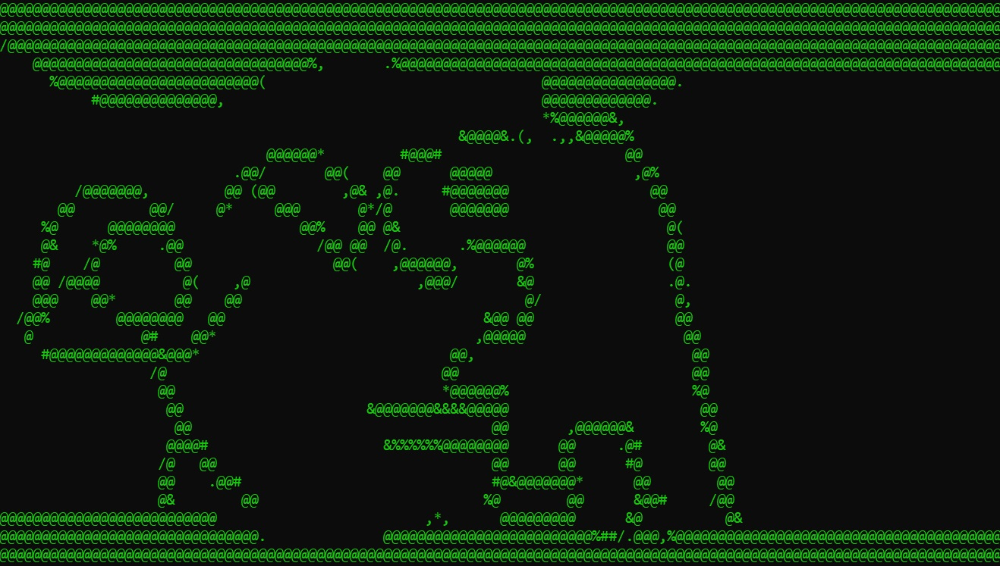

# The project
This group project was made around the end of the 1st year of TI at HU.
It involved recreating the game "Hunt The Wumpus" in the terminal.
I think it turned out pretty good.

Authors
* Jeff
* Adam
* Mark
* Johny

# Features
- Fully fledged game played in the terminal
- Randomly generated dungeon
- ASCII animations
- Able to let an AI play the game
- Tracking of stats
- Replay the same map
- Scrolling text

# Getting the game
A compiled executable can be found at in the folder
All the source code is available to compile it yourself as well